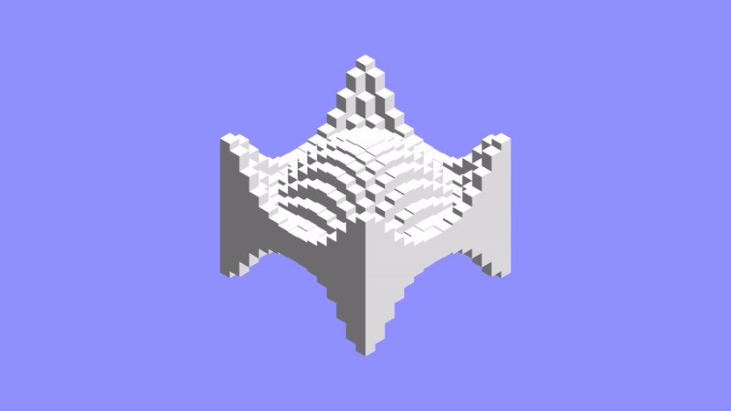

<h3 align="center"></h3>
<h1 align="center">Cube Wave</h1>

Simple and soothing loop animation

 

Using ThreeJS I created this simple animation of a group of boxes changing its size by using the sine and cosine functions, it's completely modifiable and soonish I will upload it to Wallpaper Engine

 

<h2 align="center"><a href="https://jayexdesigns.github.io/cube-wave/">TRY IT!</a></h2>
